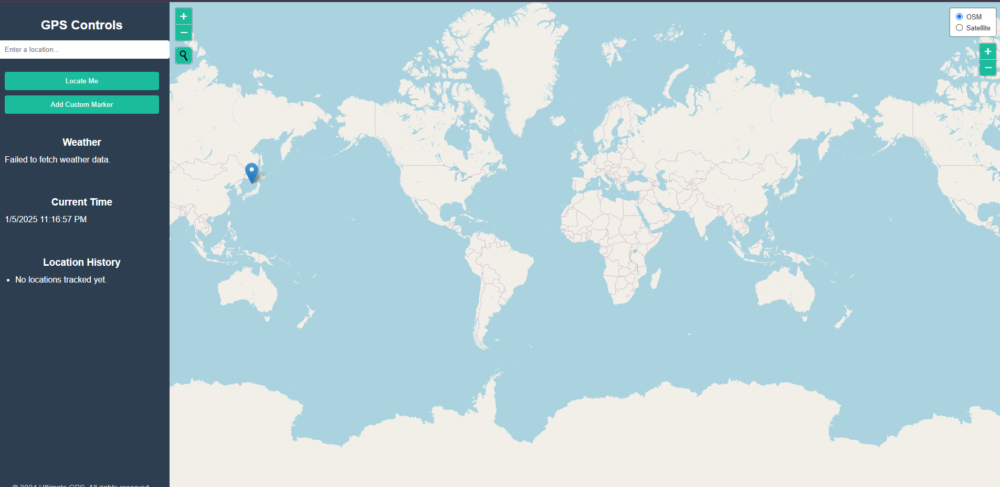

# Ultimate GPS Website

The **Ultimate GPS Website** is an interactive web application that provides users with features like location tracking, custom markers, location-based weather information, and real-time updates using the Leaflet library. The application is designed for use with OpenStreetMap (OSM) and WeatherAPI for accurate location and weather details.



## Features

- **Map Integration**:
  - Uses OpenStreetMap and OpenTopoMap for map rendering.
  - Provides satellite and OSM views with layer controls.

- **Geocoding**:
  - Search for locations using a geocoder control.
  - Add markers dynamically on the map.

- **Location Tracking**:
  - Locate the user's current location with a high degree of accuracy.
  - Add custom markers with personalized messages.

- **Weather Information**:
  - Fetch weather data for any selected location.
  - Display weather conditions and temperature in real time.

- **Time Updates**:
  - Show the current date and time, updated every second.

- **Location History**:
  - Maintain a list of all previously tracked or marked locations.

## Technologies Used

- **Frontend**:
  - HTML5, CSS3
  - JavaScript (ES6)
  - Leaflet.js (Map rendering and geocoding)

- **APIs**:
  - WeatherAPI for real-time weather data
  - OpenStreetMap for map tiles

- **Other Libraries**:
  - FontAwesome for icons
  - Leaflet Control Geocoder for geocoding functionality

## Folder Structure

```plaintext
GPS
├── .env                # Environment file to store API keys securely
├── .gitignore          # Ignored files (e.g., .env)
├── index.html          # Main HTML file
├── script.js           # JavaScript logic for the app
├── styles.css          # Custom CSS for styling the app
```

## Setup Instructions

### Prerequisites
- Node.js installed on your system
- A WeatherAPI account for the API key

### Steps
1. Clone the repository:
   ```bash
   git clone https://github.com/your-repo/ultimate-gps-website.git
   ```

2. Navigate to the project folder:
   ```bash
   cd GPS
   ```

3. Install dependencies (if any):
   ```bash
   npm install dotenv
   ```

4. Create a `.env` file in the project root and add your API key:
   ```plaintext
   WEATHER_API_KEY=your_weather_api_key_here
   ```

5. Open the `index.html` file in your browser to view the application:
   ```bash
   open index.html
   ```

## How It Works

1. **Search for Locations**:
   - Use the search bar to find any location by name.
   - Results are marked on the map with a popup.

2. **Track Current Location**:
   - Click the "Locate Me" button to find your current position on the map.
   - A circle indicates the accuracy of the location.

3. **Add Custom Markers**:
   - Add markers by manually entering latitude, longitude, and a message.

4. **Fetch Weather Information**:
   - Click anywhere on the map to fetch weather data for that location.

5. **View Location History**:
   - Track all previously marked or searched locations in the sidebar.

## Environment Variables

The `.env` file stores the WeatherAPI key:
```plaintext
WEATHER_API_KEY=your_weather_api_key_here
```

This file should not be committed to version control. Ensure it is added to `.gitignore`.

## Known Issues

- Requires an active internet connection for map and weather data.
- Browser permissions are required for location services.

## Future Enhancements

- Add more tile layers (e.g., Google Maps or Bing Maps).
- Implement route planning and navigation features.
- Store location history persistently using a database.

## License

This project is licensed under the MIT License. Feel free to use and modify it as needed.

---

Developed by [Your Name].

