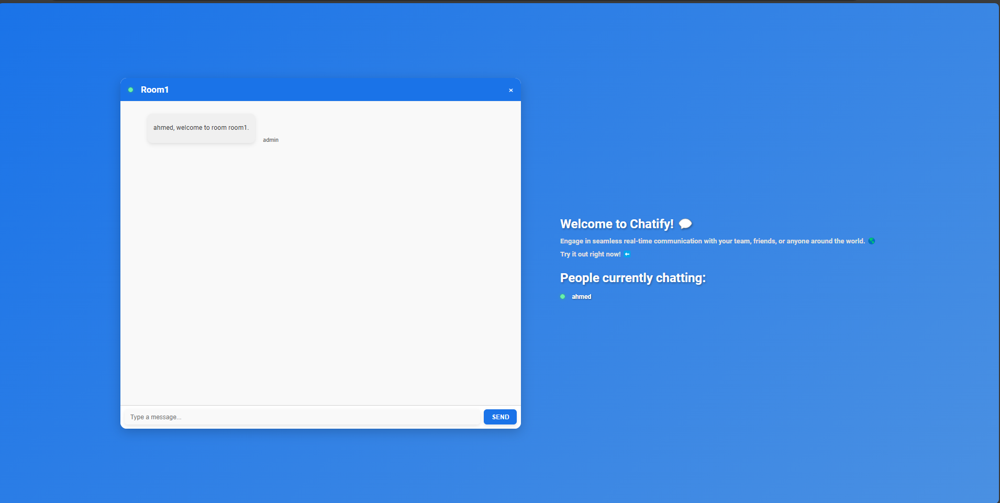

# Chat App

This project is a real-time chat application built with React, Node.js, Express, and Socket.IO. It allows users to join specific chat rooms and exchange messages in real-time.




## Features

- **Real-Time Messaging**: Communicate instantly with other users in the same room.
- **Room-Based Chat**: Join or create chat rooms for focused conversations.
- **User-Friendly Interface**: Clean and responsive design built using React.

---

## Folder Structure

### Client
This folder contains the frontend code for the chat application, built with React.

#### Components
- **Chat**: Handles the main chat interface.
  - `Chat.js`: The main React component for chat functionality.
  - `Chat.css`: Styling for the chat interface.
- **InfoBar**: Displays room information at the top of the chat interface.
  - `InfoBar.js`: Component logic.
  - `InfoBar.css`: Component styles.
- **Input**: Manages the input field for sending messages.
  - `Input.js`: Input field logic.
  - `Input.css`: Styles for the input field.
- **Join**: Handles the join page where users enter their name and room.
  - `Join.js`: Component logic.
  - `Join.css`: Component styles.
- **Messages**: Displays a list of messages in the chat room.
  - `Messages.js`: Component logic.
  - `Messages.css`: Styling for the messages.
- **TextContainer**: Displays the list of users in the room.
  - `TextContainer.js`: Component logic.
  - `TextContainer.css`: Component styles.

#### Other Files
- **`App.js`**: Main application component that handles routing between the join and chat pages【11†source】.
- **`index.js`**: Entry point for the React application. Renders the `App` component into the DOM【12†source】.

### Server
This folder contains the backend code for the chat application.

#### Files
- **`index.js`**: Main server file. Sets up Express, Socket.IO, and handles real-time events such as joining rooms and sending messages【13†source】.
- **`router.js`**: Basic Express router for handling server health checks【14†source】.
- **`users.js`**: Manages user data, including adding, removing, and retrieving users and rooms【15†source】.

---

## How to Run

### Prerequisites
- Node.js installed on your machine.

### Steps
1. Clone the repository:
   ```bash
   git clone <repository_url>
   ```
2. Navigate to the project folder:
   ```bash
   cd chat-app
   ```
3. Install dependencies for both the client and server:
   ```bash
   cd client
   npm install
   cd ../server
   npm install
   ```
4. Run the server:
   ```bash
   node index.js
   ```
5. Run the client:
   ```bash
   cd client
   npm start
   ```
6. Open your browser and navigate to `http://localhost:3000` to access the application.

---

## Technologies Used

- **Frontend**: React, React Router
- **Backend**: Node.js, Express, Socket.IO
- **Styling**: CSS

---

## Future Improvements

- Add authentication to enhance security.
- Implement private messaging between users.
- Add media sharing capabilities (e.g., images, videos).
- Improve UI/UX with animations and transitions.

---

## Contribution
Feel free to contribute to this project by creating issues or submitting pull requests. Make sure to follow the contribution guidelines.

---

## License
This project is licensed under the MIT License. See the LICENSE file for details.

