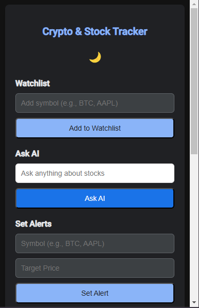

# Crypto & Stock Tracker

## Overview

The **Crypto & Stock Tracker** is a Chrome extension designed to provide users with real-time updates on cryptocurrency and stock prices. With features such as price alerts, portfolio management, and market news updates, this extension is a must-have for investors and traders.

---

## Features

- **Real-Time Price Tracking**: Track the latest prices for your favorite stocks and cryptocurrencies.
- **Customizable Price Alerts**: Get notified when a specific stock or cryptocurrency reaches your desired price.
- **Portfolio Watchlist**: Add and monitor multiple assets with ease.
- **Market News Updates**: Stay informed with the latest news relevant to your investments.
- **Light/Dark Mode**: Seamlessly switch between light and dark themes.
- **AI Integration**: Use ChatGPT for market insights and questions (requires OpenAI API key).

---

## How It Works

1. Add stock or cryptocurrency symbols to your watchlist.
2. Set target prices for alerts.
3. View real-time prices and charts.
4. Receive notifications when your target price is met.
5. Read up-to-date market news directly in the extension.

---

## Setup Instructions

1. Clone the repository:
   ```bash
   git clone https://github.com/AhmedTariq17/JavaScript-Projects.git
   cd JavaScript-Projects/ce
   ```
2. Open Chrome and go to `chrome://extensions/`.
3. Enable **Developer mode** by toggling the switch in the top-right corner.
4. Click **Load unpacked** and select the `/ce` folder.

---

## Configuration

To make the extension functional, you must add your API keys to the `config.js` file. Create or edit `config.js` as follows:

```javascript
const API_KEYS = {
  ALPHA_VANTAGE: 'your-alpha-vantage-api-key',
  FINNHUB: 'your-finnhub-api-key',
  OPENAI: 'your-openai-api-key'
};
```

---

## Files and Structure

### Core Files:
- **`manifest.json`**: Chrome extension manifest file, defining permissions and metadata.
- **`background.js`**: Handles alarms and background price tracking.
- **`content.js`**: Manages dynamic features like dark mode.
- **`popup.html`**: User interface for the extension.
- **`popup.js`**: JavaScript for user interactions and API calls.
- **`styles.css`**: Custom styles for the extension UI.

### Assets:
- **`/images/`**: Icons and visuals used in the extension.

---

## APIs Used

- **[Alpha Vantage API](https://www.alphavantage.co/)**: For real-time stock price data.
- **[Finnhub API](https://finnhub.io/)**: For cryptocurrency prices and market news.
- **[OpenAI API](https://openai.com/)**: To power the ChatGPT integration.

---

## License

This project is licensed under the MIT License. You are free to use, modify, and distribute this software under the terms of the license.

---

## Screenshots


---

## Future Enhancements

- **Multi-language Support**: Add support for additional languages.
- **Historical Data**: Provide historical price charts for assets.
- **Portfolio Analysis**: Add features for deeper portfolio insights and analytics.

---

## Contribution

Contributions are welcome! If you'd like to contribute, please fork the repository and create a pull request with your updates.

```bash
git clone https://github.com/your-username/JavaScript-Projects.git
git checkout -b feature-branch
git commit -m "Add new feature"
git push origin feature-branch
```

---

## Contact

For any questions or feedback, feel free to reach out at:
- **Email**: ahmedtariqcs@gmail.com
- **GitHub**: [AhmedTariq17](https://github.com/AhmedTariq17)

---

